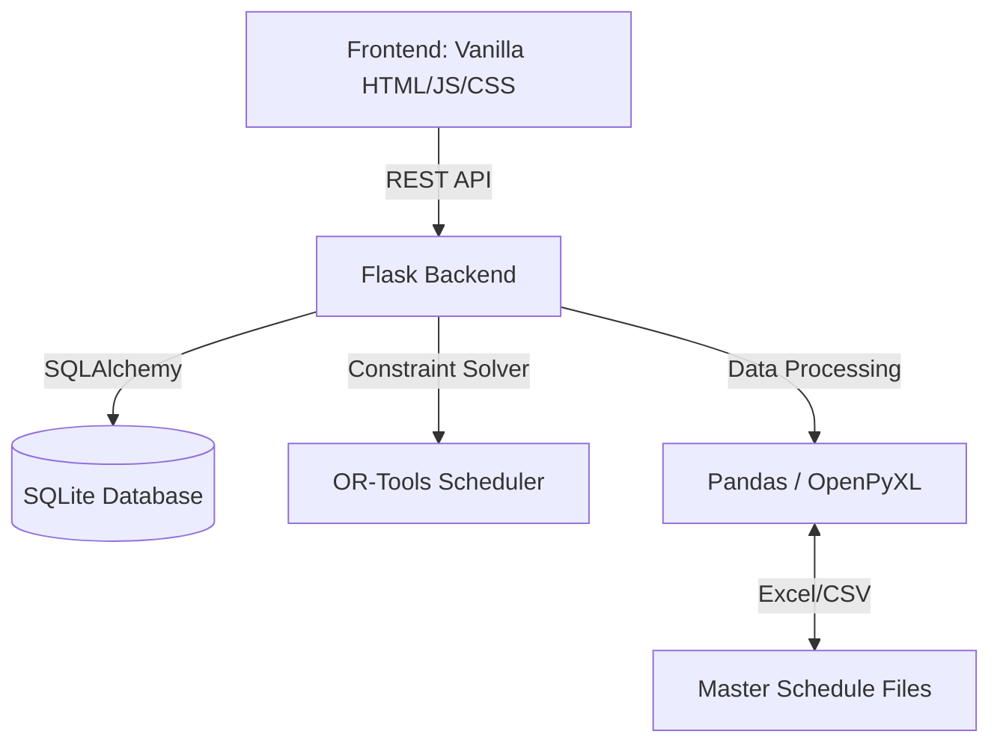

# AI College Scheduler - Project Excellence Report

## 1. Executive Summary
The **AI College Scheduler** is a state-of-the-art academic management system designed to eliminate the complexities of manual course registration and scheduling. By leveraging advanced constraint-satisfaction algorithms and a modern, high-performance UI, the system provides students with an effortless way to build their ideal weekly timetables.

> [!NOTE]
> The system currently manages **262 courses** and serves **6 registered students**, with **20 active enrollments** recorded in the master database.

---

## 2. Technical Breakthroughs & Problem Solving

During the development phase, several critical challenges were identified and overcome through innovative engineering:

### 🧩 Challenge 1: The Registration Complexity
**Issue:** Students were previously overwhelmed by long, flat lists of courses from multiple colleges, leading to registration errors and poor user experience.
**Solution:** We implemented **Hierarchical Academic Filtering**. The registration system now dynamically filters "Majors" based on the selected "College," ensuring students only see relevant options. This utilizes a RESTful API structure that maintains data integrity across the academic hierarchy.

### 🤖 Challenge 2: The Scheduling Logic (OR-Tools)
**Issue:** Manual section selection often resulted in time conflicts that were only detected after the fact.
**Solution:** We integrated **Google OR-Tools** to power our AI Schedule Generator. The system now offers three distinct variants:
- **Condensed:** Minimizes the number of days spent on campus.
- **Spread:** Distributes classes evenly to avoid long, exhausting days.
- **Moderate:** A balanced middle ground optimized for consistent gap times.
The underlying backtracking algorithm evaluates thousands of combinations in milliseconds to provide conflict-free options.

### 📥 Challenge 3: Master Data Integrity
**Issue:** Large-scale schedule imports from Excel/CSV often contained inconsistent day/time formatting (e.g., "Sun" vs "Sunday," "10 AM" vs "10:00").
**Solution:** We built a **Robust Normalization Engine** in `course_upload.py`. This module sanitizes incoming data, converts all timestamps to a standardized 24-hour integer format for conflict calculation, and rebuilds the student-facing view to ensure total consistency across the platform.

---

## 3. Core Feature Spotlight

| Feature | Description | Technology |
| :--- | :--- | :--- |
| **AI Schedule Variants** | Automated generation of Condensed, Spread, and Moderate options. | OR-Tools, Python |
| **Glassmorphism UI** | A premium, modern visual design for enhanced focus and aesthetics. | Vanilla CSS, Glassmorphism |
| **Dynamic Timetable** | An interactive grid with conflict detection and drag-and-drop logic. | CSS Grid, JavaScript |
| **Multi-Format Export** | Professional PDF and Excel exports for offline scheduling. | FPDF, OpenPyXL, Pandas |
| **Admin Command Center** | Real-time system monitoring and master section management. | Flask Blueprints, Chart.js |

---

## 4. Technical Architecture

## 5. Future Roadmap
- **Predictive Analytics:** Forecasting classroom demand based on historical registration trends.
- **Multi-Factor Optimization:** Allowing students to prioritize specific instructors or specific "off" days.
- **Mobile Integration:** Development of a dedicated PWA for schedule access on the go.

